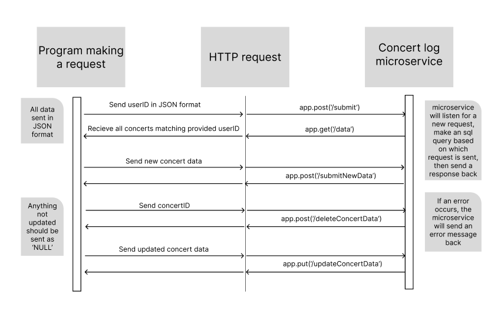

Set-up database:
Create file called passwords.js in the database folder for the microservice. Include the variables user (for your database's username), password (for your database's password), and database (for the  name of your database). Include a module.exports() line at the end of the passwords.js file to export the variables to the db-connector.js file. (This file was not included in the github repository because it contains sensitive information. However it is necessary for running the microservice's database.)

Test Program folder: This folder contains my test program. It is meant to run as a seperate program and is not part of the main microservice.

A) How to REQUEST data:
To request data for a particular user from the microservice use an async function containing an axios.post request to http://localhost:9125/submit.
Example:

async function postData() {
  try {
    const dataToSend = {"userID":1};
    const response = await axios.post('http://localhost:9125/submit', dataToSend);
    console.log('POST response:', response.data);
  } catch (error) {
    console.error(error);
  }
}

To request ADDING a new concert to a user's profile, make an axios.post request to http://localhost:9125/submitNewData. The data sent should be the userID, artist, venue, dateAttended, and notes. Only notes may be "NULL".

To request DELETING a concert from a user's profile, make an axios.post request to http://localhost:9125/deleteConcertData. The data sent should be the concertID for the concert to be deleted.

To request UPDATING a concert from a user's profile, make an axios.put request to http://localhost:9125/updateConcertData. The data sent should be the concertID, artist, venue, dateAttended, and notes. If any of these fields (other than concertID) are not updated by the user, it is important to set the data sent to 'NULL' (i.e., if a user is only updating concertID 1's venue, then the data sent should be {"concertID": 1, "artist": "NULL", "venue": "NEW VENUE", "dateAttended": "NULL", "notes": "NULL"). 

B) How to RECIEVE data:
To recieve data for the user sent in the postData() function, make an axios.get request to http://localhost:9125/data.
Example:

async function getData() {
  try {
    const response = await axios.get('http://localhost:9125/data');
    console.log('GET response:', response.data);
  } catch (error) {
    console.error(error);
  }
}

C) UML Diagram:

